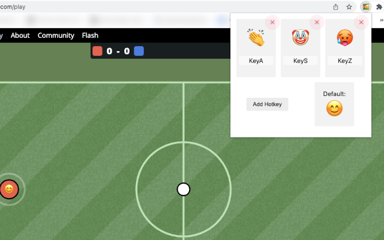

## Haxball Emoji Hotkeys 

Make hotkeys with cool avatar emojis in HaxBall! 

Clap 👏 when someone made a great shot, wave a hand ✋ if you need a pass and don't forget to end with a smile after a win 😊 

Bind emojis to the keys. They will be shown as your avatar in-game at https://haxball.com

## Usage

#### Official
Extension is during acceptation phase in Chrome Web Store. Link will be uploaded here, when accepted.

#### Unofficial/dev
1. Clone the repository
2. Go to `chrome://extensions` in Google Chrome
3. Enable developer mode
4. Click **Load extension**
5. Choose the cloned folder

## Contributing
It's been a few years since I've done anything with Vanilla JS DOM Manipulation. I'll try to clean up the code ASAP. 
Please feel free to do any kind of Pull Requests.

## License
[MIT](./LICENSE)
